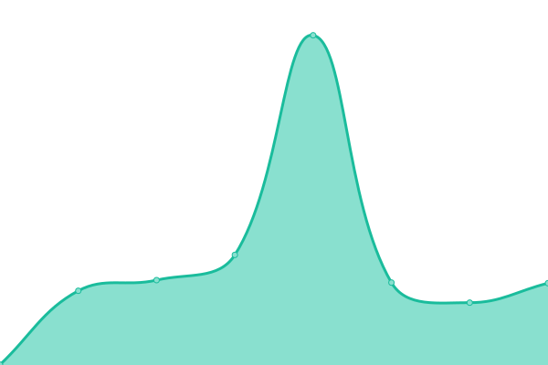

# [📈 Live Status](https://ilger05.github.io/Uptime): <!--live status--> **🟧 Partial outage**

This repository contains the open-source uptime monitor and status page for [ilger05](https://ilger05.github.io/Uptime), powered by [Upptime](https://github.com/upptime/upptime).

With [Upptime](https://upptime.js.org), you can get your own unlimited and free uptime monitor and status page, powered entirely by a GitHub repository. We use [Issues](https://github.com/ilger05/Uptime/issues) as incident reports, [Actions](https://github.com/ilger05/Uptime/actions) as uptime monitors, and [Pages](https://ilger05.github.io/Uptime) for the status page.

<!--start: status pages-->
<!-- This summary is generated by Upptime (https://github.com/upptime/upptime) -->
<!-- Do not edit this manually, your changes will be overwritten -->
<!-- prettier-ignore -->
| URL | Status | History | Response Time | Uptime |
| --- | ------ | ------- | ------------- | ------ |
|  CLD_SCN_12 | 🟩 Up | [cld-scn-12.yml](https://github.com/ilger05/Uptime/commits/HEAD/history/cld-scn-12.yml) | 

 112ms
     
 | 

<a href="https://ilger05.github.io/Uptime/history/cld-scn-12">100.00%</a>
    

|  CLD_SCN_13 | 🟩 Up | [cld-scn-13.yml](https://github.com/ilger05/Uptime/commits/HEAD/history/cld-scn-13.yml) | 

 120ms
     
 | 

<a href="https://ilger05.github.io/Uptime/history/cld-scn-13">100.00%</a>
    

|  CLD_SCN_14 | 🟩 Up | [cld-scn-14.yml](https://github.com/ilger05/Uptime/commits/HEAD/history/cld-scn-14.yml) | 

 112ms
     
 | 

<a href="https://ilger05.github.io/Uptime/history/cld-scn-14">100.00%</a>
    

|  CLD_SCN_15 | 🟩 Up | [cld-scn-15.yml](https://github.com/ilger05/Uptime/commits/HEAD/history/cld-scn-15.yml) | 

 120ms
     
 | 

<a href="https://ilger05.github.io/Uptime/history/cld-scn-15">100.00%</a>
    

|  CLD_SCN_16 | 🟩 Up | [cld-scn-16.yml](https://github.com/ilger05/Uptime/commits/HEAD/history/cld-scn-16.yml) | 

 112ms
     
 | 

<a href="https://ilger05.github.io/Uptime/history/cld-scn-16">100.00%</a>
    

|  CLD_SCN_17 | 🟩 Up | [cld-scn-17.yml](https://github.com/ilger05/Uptime/commits/HEAD/history/cld-scn-17.yml) | 

 120ms
     
 | 

<a href="https://ilger05.github.io/Uptime/history/cld-scn-17">100.00%</a>
    

|  CLD_SCN_18 | 🟥 Down | [cld-scn-18.yml](https://github.com/ilger05/Uptime/commits/HEAD/history/cld-scn-18.yml) | 

 0ms
     
 | 

<a href="https://ilger05.github.io/Uptime/history/cld-scn-18">0.00%</a>
    

|  CLD_SCN_19 | 🟥 Down | [cld-scn-19.yml](https://github.com/ilger05/Uptime/commits/HEAD/history/cld-scn-19.yml) | 

 0ms
     
 | 

<a href="https://ilger05.github.io/Uptime/history/cld-scn-19">0.00%</a>
    

|  CLD_SCN_20 | 🟩 Up | [cld-scn-20.yml](https://github.com/ilger05/Uptime/commits/HEAD/history/cld-scn-20.yml) | 

 112ms
     
 | 

<a href="https://ilger05.github.io/Uptime/history/cld-scn-20">100.00%</a>
    

|  CLD_SCN_21 | 🟩 Up | [cld-scn-21.yml](https://github.com/ilger05/Uptime/commits/HEAD/history/cld-scn-21.yml) | 

 118ms
     
 | 

<a href="https://ilger05.github.io/Uptime/history/cld-scn-21">100.00%</a>
    

|  CLD_SCN_22 | 🟩 Up | [cld-scn-22.yml](https://github.com/ilger05/Uptime/commits/HEAD/history/cld-scn-22.yml) | 

 112ms
     
 | 

<a href="https://ilger05.github.io/Uptime/history/cld-scn-22">100.00%</a>
    

|  CLD_SCN_23 | 🟩 Up | [cld-scn-23.yml](https://github.com/ilger05/Uptime/commits/HEAD/history/cld-scn-23.yml) | 

 120ms
     
 | 

<a href="https://ilger05.github.io/Uptime/history/cld-scn-23">100.00%</a>
    

|  CLD_SCN_24 | 🟩 Up | [cld-scn-24.yml](https://github.com/ilger05/Uptime/commits/HEAD/history/cld-scn-24.yml) | 

 112ms
     
 | 

<a href="https://ilger05.github.io/Uptime/history/cld-scn-24">100.00%</a>
    

|  CLD_SCN25 | 🟩 Up | [cld-scn-25.yml](https://github.com/ilger05/Uptime/commits/HEAD/history/cld-scn-25.yml) | 

 119ms
     
 | 

<a href="https://ilger05.github.io/Uptime/history/cld-scn-25">100.00%</a>
    

|  ASP_POLARIS | 🟩 Up | [asp-polaris.yml](https://github.com/ilger05/Uptime/commits/HEAD/history/asp-polaris.yml) | 

 120ms
     
 | 

<a href="https://ilger05.github.io/Uptime/history/asp-polaris">100.00%</a>
    

|  ASP3_POLARIS | 🟩 Up | [asp-3-polaris.yml](https://github.com/ilger05/Uptime/commits/HEAD/history/asp-3-polaris.yml) | 

 112ms
     
 | 

<a href="https://ilger05.github.io/Uptime/history/asp-3-polaris">100.00%</a>
    

|  MX1_SAFE_MAIL | 🟩 Up | [mx-1-safe-mail.yml](https://github.com/ilger05/Uptime/commits/HEAD/history/mx-1-safe-mail.yml) | 

 119ms
     
 | 

<a href="https://ilger05.github.io/Uptime/history/mx-1-safe-mail">100.00%</a>
    

|  MX2_SAFE_MAIL | 🟩 Up | [mx-2-safe-mail.yml](https://github.com/ilger05/Uptime/commits/HEAD/history/mx-2-safe-mail.yml) | 

 112ms
     
 | 

<a href="https://ilger05.github.io/Uptime/history/mx-2-safe-mail">100.00%</a>
    

|  ESVA01_FERCAM | 🟩 Up | [esva-01-fercam.yml](https://github.com/ilger05/Uptime/commits/HEAD/history/esva-01-fercam.yml) | 

 121ms
     
 | 

<a href="https://ilger05.github.io/Uptime/history/esva-01-fercam">100.00%</a>
    

|  ESVA02_FERCAM | 🟩 Up | [esva-02-fercam.yml](https://github.com/ilger05/Uptime/commits/HEAD/history/esva-02-fercam.yml) | 

 112ms
     
 | 

<a href="https://ilger05.github.io/Uptime/history/esva-02-fercam">100.00%</a>
    

|  AS_ZOFFICE | 🟩 Up | [as-zoffice.yml](https://github.com/ilger05/Uptime/commits/HEAD/history/as-zoffice.yml) | 

 121ms
     
 | 

<a href="https://ilger05.github.io/Uptime/history/as-zoffice">100.00%</a>
    

|  E_GW_SPIDER4WEB | 🟩 Up | [e-gw-spider-4-web.yml](https://github.com/ilger05/Uptime/commits/HEAD/history/e-gw-spider-4-web.yml) | 

 121ms
     
 | 

<a href="https://ilger05.github.io/Uptime/history/e-gw-spider-4-web">100.00%</a>
    

|  MX1_ZEUSCLD | 🟩 Up | [mx-1-zeuscld.yml](https://github.com/ilger05/Uptime/commits/HEAD/history/mx-1-zeuscld.yml) | 

 120ms
     
 | 

<a href="https://ilger05.github.io/Uptime/history/mx-1-zeuscld">100.00%</a>
    

<!--end: status pages-->

[**Visit our status website →**](https://ilger05.github.io/Uptime)

## 📄 License

- Powered by: [Upptime](https://github.com/upptime/upptime)
- Code: [MIT](./LICENSE) © [ilger05](https://ilger05.github.io/Uptime)
- Data in the `./history` directory: [Open Database License](https://opendatacommons.org/licenses/odbl/1-0/)
